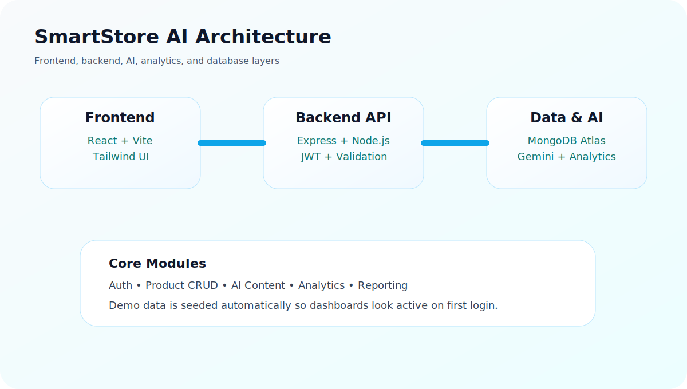
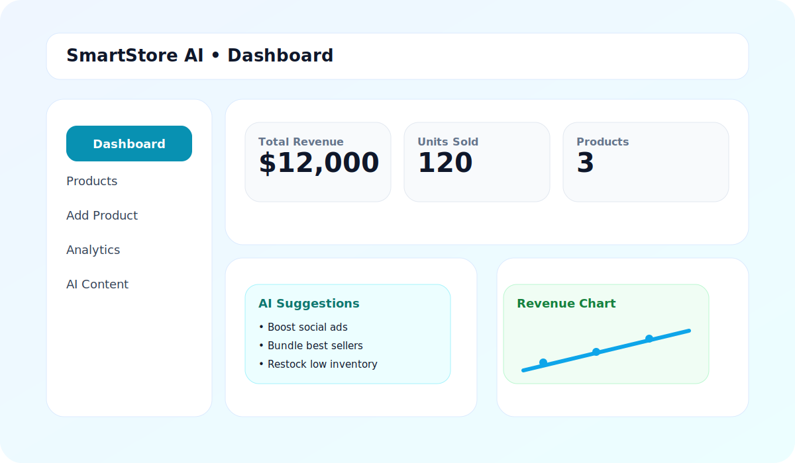
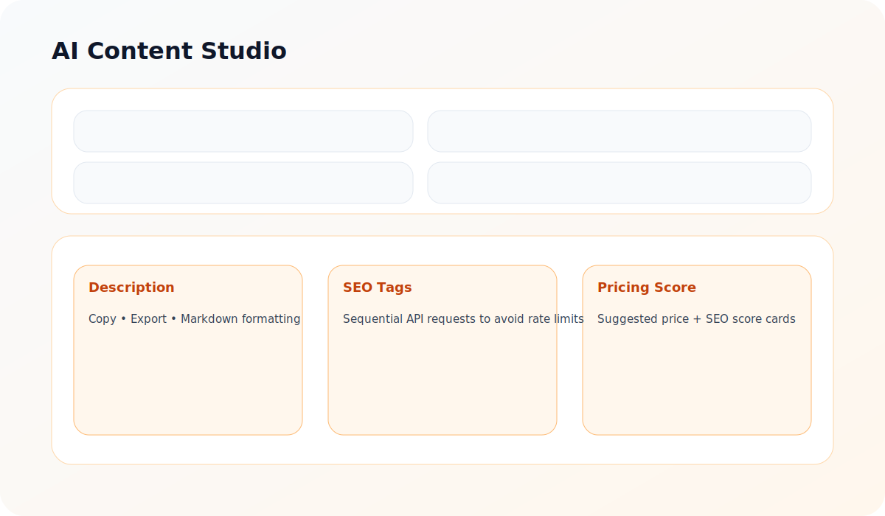

# SmartStore AI

SmartStore AI is an AI-powered e-commerce admin dashboard for store owners. It combines product management, analytics, AI content generation, and a polished light-theme admin experience in one app.

## Preview Images

### System Architecture



### Dashboard Preview



### AI Content Studio Preview



## Highlights

- JWT authentication with bcrypt password hashing
- Automatic demo product seeding after signup so dashboards feel active immediately
- Full product CRUD with thumbnails, edit modal, search, sort, and category filters
- AI content generation with Gemini `gemini-flash-latest`
- AI pricing suggestions and product scoring
- Analytics dashboards with CSV and PDF export
- Light, optimistic UI with optional dark mode
- Toast notifications and loading states for a smoother user experience

## Tech Stack

### Frontend

- React
- Vite
- Tailwind CSS
- Chart.js
- Axios
- react-hot-toast
- lucide-react
- React Markdown

### Backend

- Node.js
- Express
- MongoDB
- JWT
- bcryptjs
- express-validator
- Google Gemini API

## Project Structure

```text
SmartStore AI/
├── backend/
│   ├── config/
│   ├── controllers/
│   ├── middleware/
│   ├── models/
│   ├── routes/
│   ├── services/
│   ├── tests/
│   └── utils/
├── frontend/
│   └── src/
└── docs/
    └── images/
```

## Features

### Authentication

- Register new users
- Login with JWT
- Remember me option
- Protected route handling
- Automatic token cleanup on `401`

### Product Management

- Add product
- Edit product
- Delete product
- Product detail modal
- Product thumbnail fallback image
- Search, filter, and sort products

### AI Studio

- Product description generation
- SEO tag generation
- Marketing caption generation
- Sales suggestions
- AI pricing suggestion
- AI product score
- Markdown rendering
- Copy and export actions
- Sequential request flow with delay to reduce API pressure

### Analytics

- Revenue summary
- Top product sales
- Inventory snapshot
- CSV export
- PDF export
- Empty-state friendly demo data

## API Overview

### Auth

- `POST /api/auth/register`
- `POST /api/auth/login`
- `GET /api/auth/me`

### Products

- `GET /api/products`
- `POST /api/products`
- `PUT /api/products/:id`
- `DELETE /api/products/:id`

### AI

- `POST /api/ai/description`
- `POST /api/ai/tags`
- `POST /api/ai/caption`
- `POST /api/ai/suggestions`
- `POST /api/ai/pricing`
- `POST /api/ai/score`

### Analytics

- `GET /api/analytics/revenue`
- `GET /api/analytics/top-products`
- `GET /api/analytics/inventory`

## Environment Variables

### Backend `backend/.env`

```env
PORT=5000
MONGO_URI=your_mongodb_connection_string
JWT_SECRET=your_jwt_secret
NODE_ENV=development
GEMINI_API_KEY=your_gemini_api_key
GEMINI_MODEL=gemini-flash-latest
```

### Frontend `frontend/.env`

```env
VITE_API_BASE_URL=http://localhost:5000/api
```

## Run Locally

### Backend

```bash
cd backend
npm install
npm run dev
```

### Frontend

```bash
cd frontend
npm install
npm run dev
```

## Tests

Run backend tests:

```bash
cd backend
npm test
```

## Demo Data

Newly registered users receive sample products automatically, including example inventory and sales values so the dashboard and charts look active immediately.

Example seeded products:

- Wireless Headphones
- Smart Watch Pro
- Portable Speaker

## Adding Your Own Images

If you want to replace the sample visuals in this README, add your own screenshots to `docs/images/` and update the markdown image paths.

Suggested filenames:

- `docs/images/dashboard-preview.svg`
- `docs/images/ai-studio-preview.svg`
- `docs/images/architecture.svg`

## Deployment Notes

- Frontend: Vercel
- Backend: Render
- Database: MongoDB Atlas
- AI: Google Gemini

## Current Status

- Backend auth, products, AI, and analytics are implemented
- Frontend dashboard, product flow, analytics, and AI studio are implemented
- Demo seeding, exports, toast feedback, and dark mode are included
